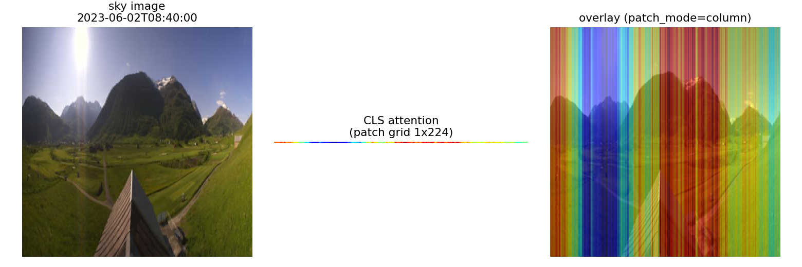

# SMT — Solar Multimodal Transformer

Code for **"Solar Multimodal Transformer: Intraday Solar Irradiance Predictor
Using Public Cameras and Time Series"** (WACV 2025).

Short-term **GHI** (Global Horizontal Irradiance) forecasting from all-sky
camera images and irradiance history. One transformer (**SMT**) fuses image
patch tokens and time-series tokens and reads out the forecast from a `[CLS]`
token; several baselines and an ablation study are included.

Everything runs on a tiny **toy slice of the ANT site** shipped in `data/toy/`
(~1.5 days at 10-min cadence, ~20 MB) — no external download needed, CPU-friendly.

<p align="center"></p>

*SMT attention (last-layer and all-layer rollout) from a trained column-patch
model: each token is one image column, and a few significant columns light up
over the sky.*

---

## Contents

1. [What's here](#whats-here)
2. [Install](#install)
3. [Quickstart](#quickstart)
4. [Models & configs](#models--configs)
5. [SMT ablations](#smt-ablations)
6. [Attention visualisation](#attention-visualisation)
7. [Target: GHI vs. GHI index](#target-ghi-vs-ghi-index)
8. [Configuration reference](#configuration-reference)
9. [Data](#data)
10. [Repository layout](#repository-layout)
11. [Citation](#citation)

## What's here

- **Models**, each driven entirely by a YAML config:
  smart-persistence baseline, CNN-LSTM (1 or 2 cameras), LSTNet, CNN-LSTM⊕LSTNet
  fusion, and the flagship **SMT** image+time-series transformer.
- **SMT ablations**: patch shape (square / row / column) and input branches
  (image-only / ts-only / image+ts).
- **Attention-rollout visualisation** overlaid on the sky image.
- **Flexible target**: predict the raw `ghi` or the `ghi_index` (clear-sky
  index); if a csv only has raw GHI, the index is derived from the site
  coordinates via pvlib.

All hyper-parameters live in `configs/*.yaml`; the CLIs are in `scripts/`.

## Install

```bash
pip install -r requirements.txt
```

Tested with Python 3.11–3.13, PyTorch ≥ 2.0, timm ≥ 1.0.

## Quickstart

A typical flow is **train → evaluate → visualise**. Use `--epochs` to shorten
runs (the toy slice is too small for real metrics).

```bash
# 0. baseline: smart persistence (no training)
python scripts/evaluate.py --config configs/persistence.yaml --persistence

# 1. train the flagship SMT
python scripts/train.py --config configs/smt.yaml --epochs 30
#    -> writes outputs/smt.pt

# 2. evaluate the checkpoint (RMSE / RSE / Corr, writes a predictions csv)
python scripts/evaluate.py --config configs/smt.yaml --ckpt outputs/smt.pt
#    -> outputs/smt_pred.csv

# 3. visualise attention (uses a shipped pretrained checkpoint; see checkpoints/)
python scripts/visualize_attention.py --config configs/ablation/smt_patch_column.yaml \
    --ckpt checkpoints/smt_column.pt --index 18 --out outputs/attention.png
```

> Two real trained SMT checkpoints (6 heads / 192-dim / 3 layers) are shipped so
> the attention figures are reproducible without training:
> `checkpoints/smt_ANT.pt` (square patches, ANT site) and
> `checkpoints/smt_column.pt` (column patches). Use each with its matching
> `patch_mode` config.

Common flags for `train.py` / `evaluate.py`: `--config` (required),
`--data-root`, `--epochs`, `--batch-size`, `--seed`, `--out`, `--ckpt`.
Experiment tracking (wandb) is stubbed out by default; pass `--wandb` to enable.

## Models & configs

Every model is one config. Train any of them with
`python scripts/train.py --config <path>`.

| config | model (`model_skeleton`) | inputs | target |
|--------|--------------------------|--------|--------|
| `configs/persistence.yaml`     | smart persistence (no NN)      | GHI history      | ghi_index |
| `configs/lstnet.yaml`          | `LSTNet`                        | GHI time series  | ghi |
| `configs/cnnlstm.yaml`         | `CNN_LSTM`                      | 1 sky image      | ghi |
| `configs/cnnlstm_2camera.yaml` | `CNNLSTM_2camera`              | 2 sky images     | ghi |
| `configs/cnnlstm_lstnet.yaml`  | `CNNLSTM_LSTNet`               | image + ts       | ghi |
| `configs/smt.yaml`             | `vit_model_img_ts` (**SMT**)   | image + ts       | ghi_index |
| `configs/smt_raw_ghi.yaml`     | `vit_model_img_ts` (**SMT**)   | image + ts       | ghi_index, **from a raw-GHI csv** (index computed from coordinates) |

`configs/ablation/` holds the SMT ablation configs (see next section).

## SMT ablations

```bash
# patch-shape ablation:  square vs row vs column tokenisation
python scripts/run_ablation.py --group patch  --epochs 10

# branch ablation:       ts-only / image-only / image+ts
python scripts/run_ablation.py --group branch --epochs 10

# everything under configs/ablation/
python scripts/run_ablation.py --group all    --epochs 10
```

Each group trains + evaluates every config in it and writes a summary table to
`outputs/ablation_<group>.csv`:

```
config                                RMSE    RSE    Corr
--------------------------------------------------------
smt_patch_square                   ...
smt_patch_row                      ...
smt_patch_column                   ...
```

Ablation configs (also runnable individually with `scripts/train.py`):

| config | what changes |
|--------|--------------|
| `ablation/smt_patch_square.yaml`  | 16×16 square patches (default) |
| `ablation/smt_patch_row.yaml`     | each token = one image **row** |
| `ablation/smt_patch_column.yaml`  | each token = one image **column** |
| `ablation/smt_branch_ts_only.yaml`| time-series branch only (`vit_model_ts`) |
| `ablation/smt_branch_img_only.yaml`| image branch only (`vit_model_img`) |
| `ablation/smt_branch_img_ts.yaml` | full image + ts model |

## Attention visualisation

```bash
# column-patch model (the headline figure)
python scripts/visualize_attention.py \
    --config configs/ablation/smt_patch_column.yaml --ckpt checkpoints/smt_column.pt \
    --index 18 --out outputs/attention.png

# square-patch model
python scripts/visualize_attention.py \
    --config configs/smt.yaml --ckpt checkpoints/smt_ANT.pt \
    --index 18 --out outputs/attention_square.png
```

Rebuilds the SMT model with its attention hook enabled, runs one image+ts
sample, and produces two CAM overlays of the `[CLS]`→image-patch attention on
the sky image (following `Attention_visualization.ipynb`):

- **last-layer attention** — the final transformer block (heads averaged);
- **all-layer rollout** — attention rollout (Abnar & Zuidema, 2020) across every
  block (identity added per layer, then multiplied together).

The map is upsampled to image resolution and blended as an additive CAM
(`show_cam_on_image`: JET colormap of the attention added onto the image, then
normalised). Works for any `patch_mode` (square / row / column). The figure at
the top uses `configs/ablation/smt_patch_column.yaml` with the shipped
`checkpoints/smt_column.pt` (each token = one image column, so significant
columns light up); a trained model gives sparse, focused attention rather than
the diffuse map of an untrained one.

## Target: GHI vs. GHI index

Set what the model predicts with `target` in the config:

| `target` | model target column | notes |
|----------|---------------------|-------|
| `ghi_index` | `GHI_percent_wrt_max` = 100 · GHI / daily-max clear-sky | clear-sky index; more stationary, recommended |
| `ghi`       | raw GHI (W/m²)      | absolute irradiance |

Both targets need the clear-sky columns (`ghi_clear_sky`,
`GHI_daily_max_clearsky`, `GHI_percent_wrt_max`) — they define the index and the
smart-persistence reference. **If your csv only has raw `ghi`, these are computed
automatically from the site coordinates** (`latitude` / `longitude` in the
config) via `smt.base_model.add_clearsky_columns` (pvlib clear-sky model). The
first run prints:

```
[preprocess] computed GHI-index columns from coords (46.630858, 8.580525) -> outputs/_cache/..._with_index.csv
```

Try it end-to-end — `configs/smt_raw_ghi.yaml` points at `data/toy/ghi_ANT_raw.csv`
(a `time,ghi`-only csv):

```bash
python scripts/train.py --config configs/smt_raw_ghi.yaml --epochs 5
```

Or convert a raw csv once, offline:

```bash
python tools/compute_ghi_index.py --csv raw_ghi.csv \
    --lat 46.630858 --lon 8.580525 --out ghi_with_index.csv
```

## Configuration reference

A config is a flat YAML whose keys are exactly the fields the engine reads; only
override what you need — the rest come from `smt/config.py:DEFAULTS`.

| field | meaning |
|-------|---------|
| `model_skeleton` | which architecture (values listed below) |
| `image_token`, `ts_token` | which input branches are active |
| `patch_mode` | `square` / `row` / `column` (image tokenisation) |
| `data_root`, `site` | build data paths `{data_root}/{site}_*` |
| `ts_data`, `image`, `image_time` | override individual data paths (optional) |
| `target` | `ghi_index` or `ghi` (→ sets the target column) |
| `latitude`, `longitude`, `altitude` | site coordinates for the GHI index |
| `horizon`, `window` | lead time and look-back, in 10-min steps (12 → 2 h, 144 → 24 h) |
| `indices` | `[test_start, test_end]` — defines the train/val/test split |
| `embed_dim`, `depth_transformer`, `num_heads`, `attn_drop`, `drop_rate` | transformer size |
| `hidCNN`, `hidRNN`, `hidSkip`, `CNN_kernel`, `skip`, `highway_window` | LSTNet size |
| `epochs_max`, `batch_size`, `lr`, `patience`, `warmup_epochs`, `seed` | training |

`model_skeleton` values: `vit_model_img_ts` (SMT), `vit_model_img`,
`vit_model_ts`, `vit_model_2img_ts`, `CNN_LSTM`, `CNNLSTM_2camera`,
`CNNLSTM_LSTNet`, `LSTNet`.

## Data

Per site the pipeline needs three files (`data_root/`):

```
{SITE}_X_224_all.npy       # (N, 3, 224, 224) uint8 sky images
{SITE}_time_224_all.npy    # (N,) image capture timestamps, index-aligned to the images
ghi_{SITE}_pure_scaled.csv # 10-min GHI time series (needs at least `time` and `ghi`)
```

The csv should ideally also contain `ghi_clear_sky`, `GHI_daily_max_clearsky`,
`GHI_percent_wrt_max`; if it has only `time` and `ghi`, those are computed from
the coordinates (see [Target](#target-ghi-vs-ghi-index)).

Build a toy slice (or a bigger one) from the full arrays:

```bash
# the shipped toy slice (1.5 days of ANT at native 10-min cadence)
python tools/make_toy_data.py --src /path/to/full_data --dst data/toy \
    --site ANT --img-start 2023-06-01 --img-end "2023-06-02 12:00"
```

**Two-camera note:** `CNNLSTM_2camera` expects two co-located cameras. The toy
config points both streams at the same ANT arrays just to exercise the code
path; for a real run set `image1` / `image2` to two different cameras.

## Repository layout

```
smt/                      core library (importable package)
  models/
    vit_model_collection.py  SMT + all ViT/ViLT variants, patch/attention blocks
    patch_special.py         ColPatchEmbed (row / column patches)
    cnn_model_collection.py  CNN_LSTM, TSImageModel (image⊕ts fusion)
    lstnet.py                LSTNet
  data_provider.py        DataGenerator_ViLT / _2img (mmap images, splits, smart index)
  engine.py               make_vilt / create_model / run_model (build + train loop)
  train_val_test.py       per-epoch train / evaluate / test
  base_model.py           pvlib clear-sky, add_clearsky_columns, metrics helpers
  preprocess.py           ensure_ghi_index (auto-compute clear-sky columns)
  config.py               YAML -> args namespace (+ defaults, target mapping)

configs/                  one YAML per model
  ablation/               SMT patch-shape and branch ablations

scripts/
  train.py                train a model from a config
  evaluate.py             evaluate a checkpoint, or the persistence baseline
  run_ablation.py         run + tabulate an ablation group
  visualize_attention.py  attention rollout overlay

tools/
  make_toy_data.py        build a toy slice from full arrays
  compute_ghi_index.py    add clear-sky / GHI-index columns to a raw-GHI csv

data/toy/                 shipped toy ANT slice (images, timestamps, GHI csv, raw csv)
checkpoints/              trained SMT models for the attention demo
  smt_ANT.pt              square patches (ANT site)
  smt_column.pt           column patches
outputs/                  checkpoints, predictions, figures (git-ignored)
```

## Citation

If you use this code, please cite:

```bibtex
@INPROCEEDINGS{10943923,
  author={Niu, Yanan and Sarkis, Roy and Psaltis, Demetri and Paolone, Mario and Moser, Christophe and Lambertini, Luisa},
  booktitle={2025 IEEE/CVF Winter Conference on Applications of Computer Vision (WACV)},
  title={Solar Multimodal Transformer: Intraday Solar Irradiance Predictor Using Public Cameras and Time Series},
  year={2025},
  volume={},
  number={},
  pages={5051-5060},
  keywords={Solar irradiance;Adaptation models;Accuracy;Time series analysis;Predictive models;Benchmark testing;Cameras;Transformers;Power markets;Forecasting;transformer;solar forecasting;multimodal;time series},
  doi={10.1109/WACV61041.2025.00494}}
```
